# Multi-Agent GST System Architecture

This document provides a detailed visual representation of the system architecture, component interactions, and data flow.

## 📐 System Architecture Overview


## 🔄 LangGraph State Machine Flow


## 🗄️ Database Schema Architecture


## 🎯 Agent Interaction Sequence


## 🐳 Docker Container Architecture

```mermaid
graph LR
    subgraph Docker Network
        subgraph App Container
            Python[Python 3.12]
            LangChain[LangChain + LangGraph]
            Agents[SQL + RAG + Classifier]
            ChromaDB_Local[ChromaDB Files]
        end
        
        subgraph DB Container
            MySQL[MySQL 8.0]
            Schema[Schema + Seed Data]
        end
        
        Python --> MySQL
        Agents --> ChromaDB_Local
        Agents -.-> GeminiAPI[☁️ Google Gemini API]
    end
    
    Host[💻 Host Machine] -->|Port 3306| MySQL
    Host -->|docker exec| Python
    Host -->|Volumes| ChromaDB_Local
    
    style App Container fill:#e3f2fd
    style DB Container fill:#f1f8e9
    style GeminiAPI fill:#fff3e0
```



## 🔐 Security Architecture

```mermaid
graph TB
    Query[User Query] --> RateLimiter[⏱️ Rate Limiter<br/>60 RPM]
    RateLimiter --> SQLValidator[🛡️ SQL Validator]
    
    SQLValidator --> Check1{Multiple<br/>Statements?}
    Check1 -->|Yes| Reject1[❌ Reject]
    Check1 -->|No| Check2{SELECT<br/>Only?}
    
    Check2 -->|No| Reject2[❌ Reject]
    Check2 -->|Yes| Check3{Dangerous<br/>Keywords?}
    
    Check3 -->|Found| Reject3[❌ Reject]
    Check3 -->|Clean| Execute[✅ Execute on<br/>Read-Only User]
    
    Execute --> MySQL[(MySQL)]
    
    Reject1 --> Error[Return Error]
    Reject2 --> Error
    Reject3 --> Error
    
    style SQLValidator fill:#fff3cd
    style Execute fill:#d4edda
    style Error fill:#f8d7da
```



## 📦 Component Dependency Graph


## 💾 Data Flow Architecture

```mermaid
graph LR
    subgraph Input
        Query[Natural Language Query]
    end
    
    subgraph Processing
        Embedding[🔢 Query Embedding]
        SQLGen[💻 SQL Generation]
        Retrieval[🔍 Vector Search]
    end
    
    subgraph Storage
        VectorDB[(ChromaDB<br/>GST Rules)]
        RDBMS[(MySQL<br/>Invoice Data)]
    end
    
    subgraph Output
        Context[📄 Retrieved Context]
        Results[📊 SQL Results]
        Answer[💬 Final Answer]
    end
    
    Query --> Embedding
    Query --> SQLGen
    
    Embedding --> VectorDB
    VectorDB --> Retrieval
    Retrieval --> Context
    
    SQLGen --> RDBMS
    RDBMS --> Results
    
    Context --> Answer
    Results --> Answer
    
    style VectorDB fill:#ffe1f5
    style RDBMS fill:#e1ffe1
    style Answer fill:#fff4e1
```



## 🚀 Deployment Architecture

```mermaid
graph TB
    subgraph Development Environment
        DevMachine[💻 Developer Machine]
        
        subgraph Docker Compose
            AppContainer[🐳 gst_app<br/>Python Application]
            DBContainer[🐳 gst_mysql<br/>MySQL 8.0]
        end
        
        LocalVolumes[📁 Local Volumes<br/>data/vector_store]
    end
    
    subgraph External Services
        GeminiCloud[☁️ Google Gemini API<br/>Cloud Service]
    end
    
    DevMachine -->|docker-compose up| Docker Compose
    AppContainer --> DBContainer
    AppContainer --> LocalVolumes
    AppContainer -.->|API Calls| GeminiCloud
    
    DevMachine -->|CLI Access| AppContainer
    DevMachine -->|Port 3306| DBContainer
    
    style AppContainer fill:#42a5f5
    style DBContainer fill:#66bb6a
    style GeminiCloud fill:#ffa726
```

## 📊 Technology Stack Layers


## 🎯 Key Architectural Decisions

### 1. **Sequential Reasoning (Option A)**
- **Decision**: Use sequential agent execution for hybrid queries
- **Rationale**: Higher accuracy by using RAG context to inform SQL generation
- **Trade-off**: Slightly slower than parallel execution, but more intelligent

### 2. **LangGraph for Orchestration**
- **Decision**: Use LangGraph instead of LangChain's AgentExecutor
- **Rationale**: Better control over state management and conditional routing
- **Benefit**: Clear visualization of agent interactions

### 3. **Docker Containerization**
- **Decision**: Separate containers for app and database
- **Rationale**: Clean deployment, easy scaling, reproducible environments
- **Benefit**: Portable across development/production

### 4. **ChromaDB for Vector Storage**
- **Decision**: Use ChromaDB instead of FAISS
- **Rationale**: Built-in persistence, simpler API, production-ready
- **Benefit**: No manual save/load of vector indices

### 5. **Read-Only Database Access**
- **Decision**: SQL agent uses read-only MySQL user
- **Rationale**: Prevent accidental data modification
- **Benefit**: Enhanced security for production use

---

**Architecture designed for**: Scalability, Security, Maintainability, and Intelligent Multi-Step Reasoning
